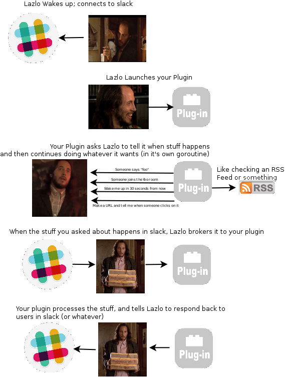

# Lazlo
## An event-driven, lua-scriptable chatops automation framework for Slack in Go. (phew)

The prototypical IRC bot responds to text. Generally, the pattern is you
provide a regex to match on, and some code to run when someone says something
in chat that matches your regular expression. Your plugin runs when a pattern
match happens, and then returns.

Your Lazlo module, by comparison is started at runtime and stays resident in
memory. Outwardly, Lazlo *acts* like a bot, but internally Lazlo works as an
event broker.  Your module registers for callbacks -- you can tell Lazlo what
sorts of events your module finds interesting. For each callback your module
registers, Lazlo will hand back a *channel*. Your module can block on the
channel, waiting for something to happen, or it can register more callbacks (as
many as you have memory for), and select between them in a loop. Throughout its
lifetime, your Module can de-register the callbacks it doesn't need anymore, and
ask for new ones as circumstances demand.

Currently there are four different kinds of callbacks you can ask for.

* [Message callbacks](docs/messagecb.md) specify regex you want to listen for and respond to. 
* [Event callbacks](docs/messagecb.md) specify [slack api events](https://api.slack.com/events) you want to listen for and respond to. 
* [Timer Callbacks](docs/timercb.md) start a (possibly reoccuring) timer (in cron syntax), and notify you when it runs down
* [Link Callbacks](docs/linkcb.md) create a URL that users can click on. When they do, their GET request is brokered back to your module. (Post and Put support coming soon)

Your module can register for all or none of these, as many times as it likes
during the lifetime of the bot. Lazlo makes it easier to write modules that
carry out common chat-ops patterns. For example, you can pretty easily write a
module that: 

1. registers for a message callback for `bot deploy (\w+)` 
2. blocks waiting for that command to be executed
3. when executed, registers for a message callback that matches the specific user that asked for the deploy with the regex: 'authenticate <password>'
4. DM's that user prompting for a password
5. registers a timer callback that expires in 3 minutes
6. Blocks waiting for either the password or the timer
7. Authenticates the user, and runs the CM tool of the week to perform the deploy
8. Captures output from that tool and presents it back to the user
9. de-registers the timer and password callbacks

That's an oversimplified example, but I think you probably get the idea. Check
out the Modules directory for working examples that use the various callbacks. 

## Lua
Lazlo ships with a module that works as a broker between lazlo and a lua state
machine. If you actually just want to write simple plugins that respond to
regex in channel, you can implement these very easily using hubot-like syntax
[in lua](docs/lua.md)

## Whats next?
* [get up and running](docs/install.md)
* [writing awesome event-driven modules in Go](docs/plugins.md)
* [writing simple, fast modules in lua](docs/lua.md)

## Current Status

Lazlo is basically working and basically documented. All callback types are
implemented and functional and there are several included modules of varying
degress of complexity that should help get you started writing your own.

### Todo's in order of when I'll probably get to them:

* a *help* module
* Leader-elections for HA bots. (moved up because heroku's new not-free dynos)
* Godoc, Documentation Documentation and Documentation
* Lua support is new and only includes support for message callbacks (hear respond and reply). I'd like you to be able to get timers and links via lua as well.
* More included plugins
