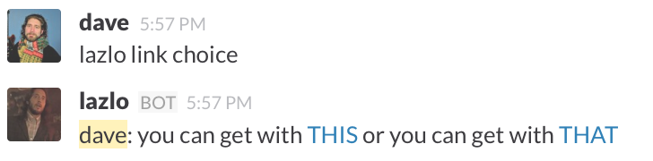
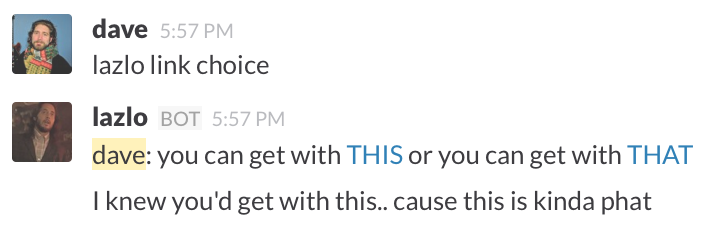

# How do I even plugin?

There are two ways you can write automation for Lazlo. The quick, simple way,
is to use Lua scripts. If you're familiar with hubot, Lazlo's lua syntax is
very similar. But this documentation is about writing automation in Go, which
is more powerful, and gives you more control but is also a bit more
complicated. 

## The lazlo.Module type
To write a lazlo module in Go, make a new file in the *modules* directory,
import lazlo's lib package (and whatever else), and create an exporable var of
type lazlo.Module. Then tell Lazlo to ingest your module by adding it to the
*loadModules.go* file in the root of the project directory. Here's a pretty
typical module preamble:

```
package modules

import(
   lazlo "github.com/djosephsen/lazlo/lib"
	// other stuff
)

var Hi = &lazlo.Module{  // note the capital H in Hi, makes this exportable
   Name: `Hi`,
   Usage: `"%BOTNAME% foo" : says hi on startup, and also replies "bar" to "%BOTNAME% foo"`,
   Run:   hiMain,
} ```

The *Module* struct has three attributes, a Name string, a Usage string, and a
function reference. Your module name is used to create an ID that will uniquely
identify your module internally. The Usage string is used by the help plugin to
print information about your bot to users. There are a few Macro's the help
module understands that make it a little easier to write usage strings. 

 * %BOTNAME% will be replaced with the value of the environment variable LAZLO.NAME
 * %HIDDEN% will instruct the help program to omit your bot from its output
 unless the user specifies an *ALL* switch

## The Lazlo Modules Run Function
The Run attribute specifies the entry point for your module. You can think of
it as your *main()* function. When Lazlo launches, once it's done with its
initial housekeeping, it'll execute your Run function in its own go-routine.
This is a little different than other bots you might have worked with that only
execute your function when something happens in chat.  Under Lazlo, your run
function gets run in parallel at startup, and does whatever you want for as
long as you want. 

Your run function is passed a reference to lazlo's broker, which you can use to
interact with the chatroom in interesting ways, but more on that in a bit. For
now, if we wanted to write a module that just said "*hi*" whenever the Bot
starts up, we could write a run function like this:

```
func hiMain(b *lazlo.Broker){
	b.Say("Hi!")
}
```

Whever Lazlo starts, he'll register our *Hi* module (add it to a slice of
modules), and execute this run function, which will use the broker to say
*Hi!* in the default room, and then exit. I think you'll agree that's not very
interesting.

## Registering for callbacks with the broker
The fun stuff begins with *callbacks*. With callbacks, we can ask the broker to
tell us when things happen. The most common kind of callback is a *Message*
callback: 

```
func hiMain(b *lazlo.Broker){
	b.Say("Hi!")
	cb := b.MessageCallback(`(?i)foo`, true)
}
```
The broker's *MessageCallback* function takes two arguments, a regex, and a
boolean which dictates wheather or not the bot needs to be mentioned by name;
ie: If this is *true* then our regex will match a command like *lazlo foo*, but
when set to false, it'll match anyone saying *foo* arbitrarily (also note the
*(?i)* token which is a golang regex convention for case insensitivity). 

The *MessageCallback* function returns a custom type called, unimaginatively:
*MessageCallback*. A pointer to this callback is registered in a top-level data
structure within the broker. This is the same struct Lazlo uses internally to
check for matches, and enables you to tell the broker to *DeRegister* it later
if you wish. It contains some metainfo about your callback, as well as a
channel, which is really the cruxt of the whole system. 

```
type MessageCallback struct{
   ID             string //created automatically by the broker
   Pattern        string //your regex pattern
   Respond        bool // if true, only respond if the bot is mentioned by name
   Chan           chan PatternMatch
}
```
## Callback channels
Each type of callback returns a different type of callback struct, and each
type of callback struct contains a channel of one kind or another. In the case
of the *MessageCallback* type, we get a channel that spits out *PatternMatch*
structs.

Every time someone says something in chat that matches the regex we specified
when we registered the callback, this channel will spit out a struct with
information about the message that matched. Now we can block, or select on these
channels as a means of responding to events that happen in chat.

```
func hiMain(b *lazlo.Broker){
	b.Say("Hi!")
	cb := b.MessageCallback(`(?i)foo`, true)
   for {
      pm := <- cb.Chan // block waiting for someone to say "bot foo"
      pm.Event.Reply("bar")
   } // loop forever (don't return)
}
```

## Multi-pattern regex
Now we have a fully functional Lazlo Go Module, that will say *Hi!* when Lazlo
first starts up, and will respond with *bar* whenever a user says *<botname>
foo*. Lets complicate it a bit with a logical OR in our regex:

```
func fooOrBar(str string) string{
	if str == foo{
		return "bar"
	}else{
		return "biz"
	}
}

func hiMain(b *lazlo.Broker){
	b.Say("Hi!")
	cb := b.MessageCallback(`(?i)(foo|bar)`, true)
   for {
      pm := <- cb.Chan
		response:=fooOrBar(pm.Match[1])
      pm.Event.Reply(response)
   }
}
```

Now we're using the *PatternMatch.Match* slice to detect whether the user
actually said *foo* or *bar*, and responding appropriately (note: our fooOrBar
function will eventually incorrectly answer *biz* because it doesn't handle
case insensitivity properly).

Alternatively, we could have implemented these options as two separate callbacks: 

```
func hiMain(b *lazlo.Broker){
	b.Say("Hi!")
	fooCB := b.MessageCallback(`(?i)foo`, true)
	barCB := b.MessageCallback(`(?i)bar`, true)
   for {
		select{
		case pm := <- cbFoo.Chan:
      	pm.Event.Reply("bar")
		case pm := <- cbBar.Chan:
      	pm.Event.Reply("biz")
		}
   }
}
```
Now we have one callback each for foo and bar, and we're using a select wrapped
in a for loop to choose between them. That's more often the sort of pattern
you'll use in real life, and it's also pretty nifty. Note we don't have to put
this for-loop in series. We could certainly spin off a go-routine to select on
incoming events while we go and do something else.  

## 4 types of callback
Lazlo has three other callback types that make things even more interesting.

### EventCallbacks 
You can use *EventCallback* to get raw events from the Slack RTM API as they
happen. A list of the event types can be found
[here](https://api.slack.com/events). Simply supply a key/value pair to the
callback Function like so: 

```
cb := b.EventCallback("type","group_open")
```
and any events whose json regexp matches your key and value will be spit out of
cb.Chan as *map[string]interface{}". (pro tip: Check the lib/slacktypes.go file for
native Go implementations of many of the common slack json structures.)

### TimerCallback
If you want to periodically check a database, or call out to an API, you can
ask the broker for a *TimerCallback*. You specify a cron-syntax schedule like
so:

```
cb := b.TimerCallback("*/20 * * * * * *`)  //every 20 seconds
```
And cb.Chan will spit out a [*time.Time*](http://golang.org/pkg/time/#Time) at
the time of the next occurance specified by your schedule.  If your schedule is
reoccuring, like the one in the example above, Lazlo will reschedule it for
you. Pro-tip: You can get a time.Time that represents the next occurance for your
*TimerCallback* by reading *cb.Next*.

Check out modules/rtmping.go for an example of *TimerCallback* in the wild

###LinkCallback
Lazlo runs a built-in HTTP server, which is necessary to run on certain PaaS
providers like Heroku, but otherwise isn't really required or functional.
*LinkCallback*'s change that, allowing you to register new API paths that link
back to Lazlo's built-in HTTP server. This enables some interesting out-of-band
signaling patterns. 

We can, for example register a few links, and present them to our users in the
form of a multiple-choice question. 



Then when the user clicks on one link or the other, a corrisponding HTTP GET
request is sent from the users client to Lazlo's HTTP server, which in turn
spits it out the corresponding callback channel (*cb.Chan*) as an
[*http.Response*](http://golang.org/pkg/net/http/#Response) value . My plugin
can then ingest the user's decision, de-register the callbacks, and respond to
the user via the chat-channel.



Check out modules/linktest.go for an examplel of *LinkCallback* in the wild.

### To be continued
* getting slack meta-info
* in-memory and redis-backed Persistence (lazlo brain)
